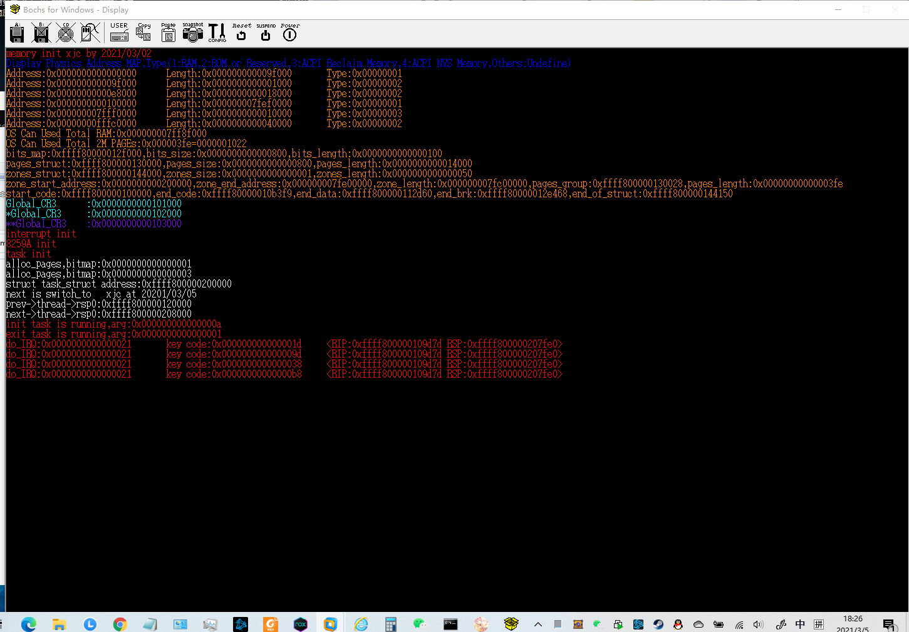

#2021/03/05

**问题：**
第一次编译过了，但是运行报了excption。 然后改了改编译都过不了了，一个是interrupt.h里面多了一个ptrace.h。现在还不知道是干嘛的。第二是因为memory.c里面注释了2行，我没有
> //	for(i = 0;i < 10;i++)
> 
> //		*(Phy_To_Virt(Global_CR3)  + i) = 0UL;

已经忘了是干啥的了。

问题依然在，依旧在报异常。再查查。
问题几个：一个interrupt.c没改

傻逼作者把trap.c重写了。

傻逼了，之前调试的时候把main函数的task_init注释了。

麻痹，又是异常

测试了他的源码，可以的，但是我的不行。吃个饭，回来再说。

main函数里的初始化系统向量，我初始化了2次。。。
之后head.s的报错是最后丢了几个字符，我也不清楚为啥。

